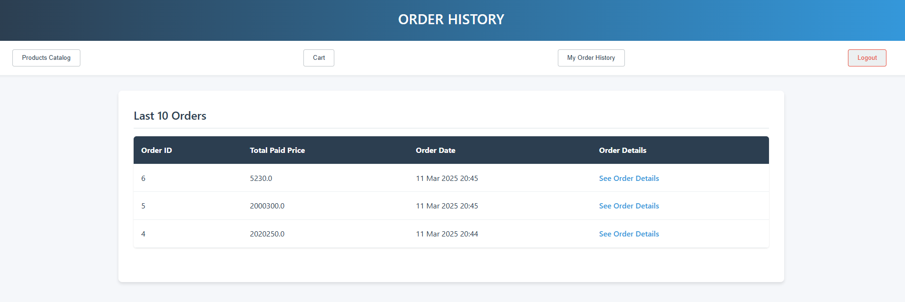

# Online Marketplace

A comprehensive e-commerce web application developed using Spring Boot, Thymeleaf, HTML, CSS, and packaged with Maven and Docker.

## Project Overview

This online marketplace allows users to browse products, add them to a shopping cart, and make purchases. It supports two user roles:
- **Customers**: Can browse products, manage carts, and place orders
- **Administrators**: Have additional privileges to manage products and orders

Key features include product catalog browsing, shopping cart functionality, user authentication, order history, and administrative capabilities—all with intuitive data handling (e.g., preserving historical pricing in orders).

## Tech Stack

- Maven
- Spring Boot
- Thymeleaf
- HTML & CSS
- Docker

## Features

### Docker Setup
- Multi-container setup with Docker Compose
- Spring Boot application and MySQL database containers
- Volume persistence for database data
- Network configuration for container communication

### Product Catalogue
- Product listings
- Detailed product pages showing name, price, description
- Purchase functionality from product pages

### Shopping Cart
- Add/remove items and adjust quantities
- Price calculation per item and total
- Checkout functionality

### Customer Features
- User registration and authentication
- Order history viewing
- session management

### Administrator Features
- Product management (add, modify, hide)
- Order processing and status updates
- Dashboard for comprehensive management
- Price history preservation in orders

## Database Design

The application uses a MySQL database with the following core tables:
- **users**: User information (id, username, password, role)
- **products**: Product details (id, name, price, description, hidden)
- **carts**: Links users to products with quantities
- **orders**: Order information (order_id, user_id, order_date, total_price, delivered)
- **order_items**: Individual items in each order with price history

## MVC Architecture

The application implements the Model-View-Controller pattern:
- **Models**: Java classes representing data entities
- **Views**: Thymeleaf templates rendering dynamic HTML
- **Controllers**: Spring controllers handling HTTP requests
- **Services**: Business logic layer
- **Repositories**: Data access layer for database operations
- 
## Project Structure

```
marketplace/
├── src/
│   ├── main/
│   │   ├── java/com/marketplace/
│   │   │   ├── controller/
│   │   │   ├── model/
│   │   │   ├── repository/
│   │   │   ├── service/
│   │   │   └── MarketplaceApplication.java
│   │   └── resources/
│   │       ├── templates/
│   │       ├── static/
│   │       └── application.properties
├── Dockerfile
├── docker-compose.yml
├── pom.xml
└── README.md
```

## Project Documentation

### Full Report
The complete project report with detailed implementation descriptions and screenshots can be found in the marketplaceSubmission directory:
- View the HTML report: [project-report.html](marketPlaceSubmission/project-report.html)
- All screenshot references in the report are available in the `marketPlaceSubmission` directory

### If you do not want to view the report here is some project info below :)

## Screenshots
Here's an overview of the application's main interfaces:

| Feature | Screenshot |
|---------|------------|
| Product Catalog |  |
| Product Details |  |
| Shopping Cart |  |
| Login Interface |  |
| Order History |  |
| Admin Dashboard |  |
| Docker Running |  |

### Database Schema

#### users
The `users` table stores user account information:
| Field    | Type         | Null | Key | Default | Extra          |
|----------|--------------|------|-----|---------|----------------|
| id       | bigint       | NO   | PRI | NULL    | auto_increment |
| username | varchar(255) | NO   | UNI | NULL    |                |
| password | varchar(255) | NO   |     | NULL    |                |
| role     | varchar(255) | NO   |     | NULL    |                |

- **id**: Unique identifier for each user
- **username**: Unique username for login (cannot be duplicated)
- **password**: Encrypted password for authentication
- **role**: User role (CUSTOMER or ADMIN)

#### products
The `products` table contains the product catalog information:
| Field       | Type         | Null | Key | Default | Extra          |
|-------------|--------------|------|-----|---------|----------------|
| id          | bigint       | NO   | PRI | NULL    | auto_increment |
| productName | varchar(255) | NO   | UNI | NULL    |                |
| price       | varchar(255) | NO   |     | NULL    |                |
| description | text         | YES  |     | NULL    |                |
| hidden      | tinyint(1)   | YES  |     | 0       |                |

- **id**: Unique identifier for each product
- **productName**: Unique name of the product
- **price**: Current price of the product
- **description**: Detailed product description
- **hidden**: Flag to determine if product is visible to customers (0=visible, 1=hidden)

#### carts
The `carts` table manages the shopping cart functionality:
| Field      | Type       | Null | Key | Default | Extra |
|------------|------------|------|-----|---------|-------|
| user_id    | bigint     | NO   | PRI | NULL    |       |
| product_id | bigint     | NO   | PRI | NULL    |       |
| quantity   | int        | NO   |     | 1       |       |
| ordered    | tinyint(1) | NO   |     | 0       |       |

- **user_id**: Reference to the user who owns the cart
- **product_id**: Reference to the product in the cart
- **quantity**: Number of units of the product in the cart
- **ordered**: Flag indicating if the cart item has been ordered (0=in cart, 1=ordered)

#### orders
The `orders` table tracks customer orders:
| Field        | Type       | Null | Key | Default           | Extra             |
|--------------|------------|------|-----|-------------------|-------------------|
| order_id     | bigint     | NO   | PRI | NULL              | auto_increment    |
| user_id      | bigint     | NO   | MUL | NULL              |                   |
| order_date   | timestamp  | NO   |     | CURRENT_TIMESTAMP | DEFAULT_GENERATED |
| totalBAPrice | double     | NO   |     | NULL              |                   |
| delivered    | tinyint(1) | NO   |     | 0                 |                   |

- **order_id**: Unique identifier for each order
- **user_id**: Reference to the user who placed the order
- **order_date**: Timestamp when the order was placed
- **totalBAPrice**: Total price of the order (preserves historical pricing)
- **delivered**: Order delivery status (0=pending, 1=delivered)

#### order_items
The `order_items` table stores the individual items within each order:
| Field           | Type   | Null | Key | Default | Extra          |
|-----------------|--------|------|-----|---------|----------------|
| order_item_id   | bigint | NO   | PRI | NULL    | auto_increment |
| order_id        | bigint | NO   | MUL | NULL    |                |
| product_id      | bigint | NO   | MUL | NULL    |                |
| bought_at_price | double | NO   |     | NULL    |                |
| quantity        | int    | NO   |     | NULL    |                |

- **order_item_id**: Unique identifier for each order item
- **order_id**: Reference to the parent order
- **product_id**: Reference to the product ordered
- **bought_at_price**: Historical price of the product at purchase time
- **quantity**: Number of units ordered

### Entity Relationships

- **One-to-Many**: User to Orders (one user can have many orders)
- **One-to-Many**: Order to Order Items (one order can contain many items)
- **Many-to-Many**: Users to Products via Carts (users can have many products in cart)
- **Many-to-One**: Order Items to Products (many order items can reference one product)

### Key Database Features
- **Composite Primary Keys**: The carts table uses a composite primary key (user_id, product_id)
- **Foreign Key Constraints**: Ensures referential integrity between related tables
- **Timestamp Auto-generation**: Order dates are automatically set to current time when created
- **Historical Pricing**: The system preserves product prices at the time of purchase in both orders and order_items tables
- **Soft Delete**: Products use a 'hidden' flag rather than being permanently deleted
## Getting It Working

### Prerequisites
- Docker and Docker Compose
- Java Development Kit (JDK) 21
- Maven

### Running the Application

1. Clone the repository
2. Build the application:
   ```
   mvn clean package
   ```
3. Start the Docker containers:
   ```
   docker-compose up
   ```
4. Access the application at http://localhost:8080

### Default Accounts
- Administrator: 
  - Username: admin
  - Password: admin
- Or can sign up as customer
## Docker Configuration

### Dockerfile
```
FROM openjdk:21
COPY target/marketPlace-0.0.1-SNAPSHOT.jar app.jar
ENTRYPOINT ["java", "-jar", "app.jar"]
```

### docker-compose.yml
```yaml
services:
  # MySQL Database Container
  mysql-db:
    image: mysql:8.0
    container_name: mysql-container
    restart: always
    environment:
      MYSQL_ROOT_PASSWORD: rootpassword
      MYSQL_DATABASE: marketplace
      MYSQL_USER: marketuser
      MYSQL_PASSWORD: marketpassword
    ports:
      - "3307:3306"
    volumes:
      - mysql-data:/var/lib/mysql
    networks:
      - springboot-mysql-net

  # Spring Boot Application Container
  app:
    build: .
    container_name: springboot-app
    restart: always
    depends_on:
      - mysql-db
    environment:
      SPRING_DATASOURCE_URL: jdbc:mysql://mysql-db:3306/marketplace?useSSL=false&allowPublicKeyRetrieval=true
      SPRING_DATASOURCE_USERNAME: marketuser
      SPRING_DATASOURCE_PASSWORD: marketpassword
    ports:
      - "8080:8080"
    networks:
      - springboot-mysql-net

volumes:
  mysql-data:

networks:
  springboot-mysql-net:
```

## Course Information

- **Course:** COMP30860 Web Development
- **Semester:** Spring 2025
- **Student:** Artjoms Kucajevs

